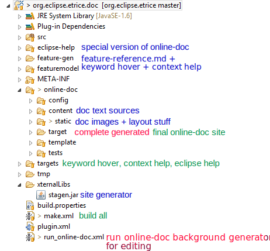

eTrice documentation + help
=======

**Prerequistes**:

- Featurizer (Download from Bitbucket and install)
- Stagen (Download .jar from Bitbucket and put it to folder */xternalLibs*, **Java 8 **)
- saxon9he.jar (in folder */xternalLibs*)

## Project Structure

## Artifacts

Feature model, including

- Keyword hover
- Eclipse context help
- Feature Reference documentation part (feature-reference.md)

Online Help Site

Eclipse Help

## HowTo Edit

To update/publish everything run *make.xml*. Logs can be found in folder */tmp*.
Prerequisite: Make at least a dummy change in featuremodel/etrice.featurizer to force code generation to folder */feature-gen*.

### FeatureModel

All artifacts are automatically generated to folder */feature-gen* on change. *make.xml* copies them to the final location:

- *feature-reference.md* to folder */online-doc/content*
- else to folder */targets*

### Build

To build the documentation there are two use cases:

- incremental build during editing of the *.md sources. To do so run-online-doc has to be executed. It starts a background
process which never terminates (when finished kill the Java process using the Windows Task Manager)
- one time build e.g. after pulling the repo. To do so launch make-doc

*Note:* In both cases the featurizer should have generated so that its generated code in folder "feature-gen" is available.
To force a re-generation open a *.featurizer file, make a change and save.

### Online Help Site

The documentation content resides in folder */content* (exception *feature-reference.md* is copied there). The output folder for the complete generated site is */online-doc/target*. Run Ant script *run_online-doc.xml* to start Stagen.

#### Stagen

A static site generator, readme can be found in the repository. A modified version is used, that supports

- xtext syntax highlighting
- toc generation
- markdown within tables (every table cell is generated isolated)

### Eclipse Help

Basically derived from Online Help Site by the means of copying and generating, but with different layout.

